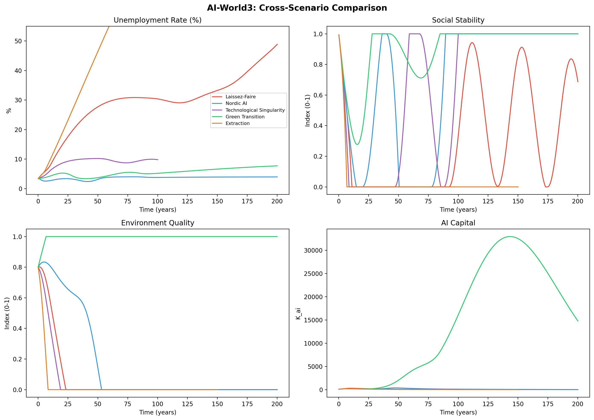
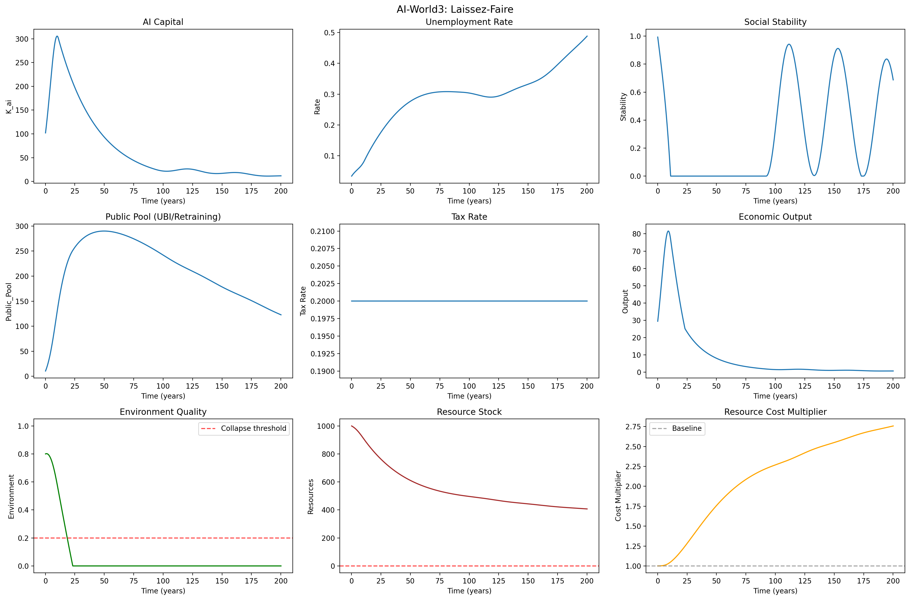
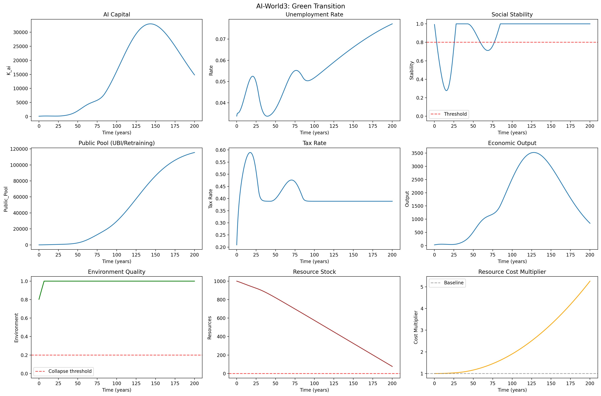
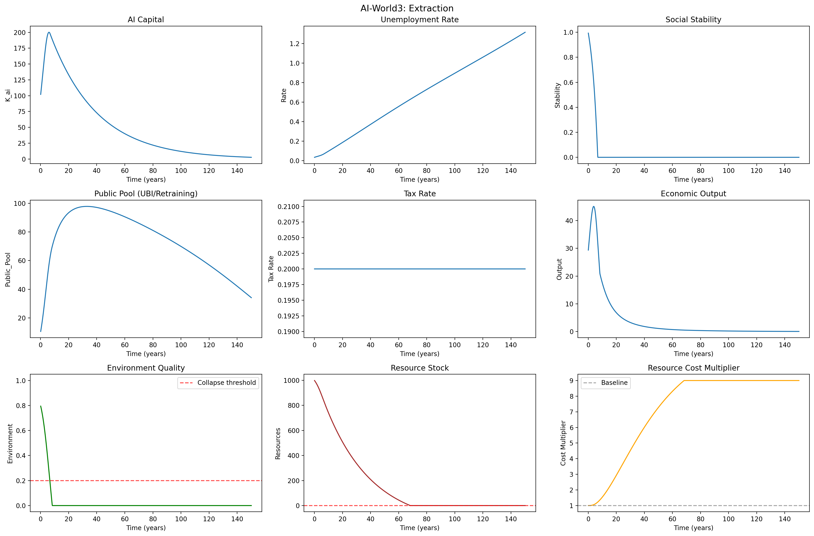

# AI-World3

## Modeling the Interplay Between AI Automation, Social Stability, and Environmental Limits

*A System Dynamics Exploration*

**Janne Haarni**
February 2026

*The model design, implementation, analysis, and drafting of this paper were performed by Claude (Anthropic), a large language model, under the author's direction.*

---

## Contents

1. [Summary](#summary)
2. [Introduction](#1-introduction)
3. [Historical Context: World3 and the Limits to Growth](#2-historical-context-world3-and-the-limits-to-growth)
4. [The Model](#3-the-model)
5. [Scenarios](#4-scenarios)
6. [Findings](#5-findings)
7. [Discussion: Limitations and Interpretation](#6-discussion-limitations-and-interpretation)
8. [Appendix: Model Specification](#appendix-model-specification)

---

## Summary

AI-World3 is a system dynamics model that explores the long-term consequences of AI-driven automation on employment, social stability, environmental quality, and natural resource stocks. Inspired by the World3 model from the 1972 Limits to Growth study, it uses stock-and-flow dynamics with feedback loops to examine how different policy and technology choices shape outcomes over 100–200 year horizons.

The model tracks six interacting state variables: AI capital, unemployment, social stability, a public fiscal pool for retraining and UBI, environmental quality, and natural resource stocks. A central feedback mechanism links social instability to emergency taxation, which funds retraining programs but also dampens investment — creating a balancing loop between growth and social protection.

Five scenarios were tested, spanning no-intervention to aggressive welfare states to exponential automation and green technology paths. The central finding is that social policy alone is insufficient: even the Nordic scenario, with the strongest safety net, fails to prevent environmental collapse. Only the Green Transition scenario — combining social policy with dynamic clean technology improvement — sustains both social stability and environmental quality. However, even this scenario eventually hits resource limits, and it trades lower economic growth for environmental sustainability.

This is an exploratory model, not a predictive one. Its value lies in the qualitative relationships it reveals between automation, policy, employment, and environment, rather than in specific numerical forecasts.

---

## 1. Introduction

The rapid advancement of artificial intelligence and automation technologies raises fundamental questions about the future of work, the stability of social institutions, and the sustainability of economic growth. These questions are interconnected in ways that resist simple analysis: automation displaces workers, which strains social stability, which triggers policy responses that affect investment, which shapes the pace of further automation. Meanwhile, the environmental and resource costs of economic growth operate on their own timescales, creating constraints that compound with social pressures.

System dynamics modeling offers a framework for reasoning about these interconnections. Rather than predicting specific outcomes, it formalizes assumptions about feedback loops and allows us to explore how different structures produce different qualitative behaviors — exponential growth, oscillation, overshoot, collapse, or equilibrium.

AI-World3 applies this approach to the intersection of AI automation and sustainability. It is deliberately simplified: the model uses six state variables and roughly twenty parameters to capture the essential feedback loops between AI capital growth, labor displacement, social stability, fiscal policy, environmental degradation, and resource depletion. The simplification is intentional — the goal is to understand which feedback structures dominate under different assumptions, not to forecast GDP in 2050.

The model was developed iteratively. An initial version revealed structural problems — universal early collapse driven by scale incoherence, unrealistic labor dynamics, and extreme parameter tuning in scenario definitions. These were addressed through a systematic revision that introduced hybrid displacement dynamics, job creation saturation, structural mismatch friction, and dynamic technology improvement mechanisms. The revised model produces qualitatively different and more informative results across scenarios.

A note on methodology: the entire workflow behind this paper — model specification, Python implementation, iterative debugging, scenario design, parameter tuning, sensitivity analysis, plot generation, and the drafting of this text — was performed by a large language model (Claude [Opus 4.6], by Anthropic) working in dialogue with the author. The author provided high-level direction, chose between design alternatives, identified problems in intermediate results, and guided the overall narrative. The LLM wrote and executed all code, diagnosed and fixed modeling errors (such as the unemployment convergence issue described in Section 3.3), ran the simulations, and produced the analysis. This itself is a small demonstration of the kind of human-AI collaboration the model attempts to reason about: a workflow where human judgment steers AI execution through iterative feedback, with each side contributing what it does best.

---

## 2. Historical Context: World3 and the Limits to Growth

AI-World3 takes its name and methodological inspiration from the World3 model developed at MIT in the early 1970s. Understanding that lineage — and particularly the pattern of misrepresentation that followed its publication — provides important context for how this type of modeling should and should not be interpreted.

### 2.1 The Original Model

In 1971, Jay Wright Forrester, the founder of system dynamics at MIT, created the first global system dynamics model (World1/World2) at the invitation of the Club of Rome. This work was extended by Donella Meadows, Dennis Meadows, Jørgen Randers, and William Behrens III into the World3 model, which formed the basis of The Limits to Growth, published in 1972.

World3 modeled the interactions between world population, industrial production, food production, pollution, and non-renewable resource consumption from 1900 to 2100. The standard-run (business-as-usual) scenario projected that continued exponential growth would lead to overshoot and decline in the mid-to-late 21st century — with industrial output peaking around 2015, pollution peaking around 2035, and population declining after 2030. The report presented twelve scenarios, not a single prediction, demonstrating how different policy choices could lead to very different outcomes.

### 2.2 The Strawman and the Dismissal

Almost immediately, critics mischaracterized the report as predicting that the world would run out of resources by the year 2000. This was demonstrably false — all reversal points in the standard run lie well beyond 2000, and the book contains no specific resource depletion dates. As energy analyst Matthew Simmons noted, there was not a single sentence about an oil shortage or limits to any specific resource by 2000.

Nevertheless, this strawman became the dominant narrative. Economists like Julian Simon argued that human ingenuity would always overcome resource constraints, framing the debate as optimism versus pessimism rather than engaging with the model's actual structure. When the year 2000 arrived without global collapse, critics declared the model falsified — attacking a claim the model had never made.

This pattern of misrepresentation is relevant to any system dynamics modeling effort. The most common critique of such models — that they got the numbers wrong — fundamentally misunderstands their purpose. System dynamics models explore how feedback structures shape qualitative behavior (overshoot, oscillation, collapse, equilibrium). Demanding precise numerical prediction from a structural exploration tool is like criticizing a wind tunnel model for failing to predict the exact arrival time of a specific flight.

### 2.3 Retrospective Validation

The irony of the premature dismissal became clear when researchers began comparing actual data to the model's projections. In 2008, Graham Turner published a study comparing 30 years of observed global data (1970–2000) to the original scenarios. The result: actual data tracked the standard-run scenario with striking consistency across nearly all variables. A 2012 update extending the comparison to 40 years confirmed the pattern. More recent studies, including a 2024 recalibration using data through 2022, continue to find that the world has tracked the business-as-usual scenario far more closely than any optimistic alternative.

This does not mean the 1972 model was correct in all its details. It means that its core insight — that exponential growth within a system of finite resources and delayed feedback creates the structural conditions for overshoot — has been vindicated as a qualitative description of the trajectory we are on.

### 2.4 Relevance to AI-World3

AI-World3 operates in the same methodological tradition. It does not predict that Nordic-style policy will produce exactly 4% unemployment, or that a Green Transition will sustain environmental quality at exactly 1.0. What it does is formalize a set of feedback loop hypotheses and explore their qualitative implications under different structural assumptions. The scenarios are thought experiments, not forecasts.

The lesson from World3's reception is clear: the value of system dynamics modeling lies in revealing the behavioral consequences of feedback structures, not in point predictions. Critics who attack specific numbers miss the point, just as they did fifty years ago.

---

## 3. The Model

AI-World3 tracks six state variables (stocks) integrated over time using forward Euler integration. The stocks interact through flows governed by approximately twenty parameters, creating a network of positive and negative feedback loops. A complete mathematical specification is provided in the Appendix; this section describes the model's structure qualitatively.

### 3.1 State Variables

**AI Capital (K_ai)** represents the total accumulated AI and automation infrastructure. It grows through investment (scaled by economic output and social stability) and decays through depreciation. Higher capital produces more economic output but also drives both labor displacement and environmental emissions.

**Unemployment (Labor_U)** tracks displaced workers in absolute terms. The labor force grows with the economy, and the unemployment rate (Labor_U / Labor_Force) is the key dimensionless variable. Workers are displaced through two mechanisms: growth-driven displacement (new automation replacing existing roles) and ongoing churn (continuous process improvements automating existing positions). Workers re-enter employment through natural job creation (new sectors and roles) and government-funded retraining.

**Social Stability** is a normalized index (0–1) representing the resilience of social institutions. It is drained by unemployment, high taxation, and environmental degradation, and sustained by public spending on safety nets. When stability falls below a configurable threshold, an emergency tax trigger activates, diverting economic output to public programs.

**Public Pool** represents the fiscal capacity available for UBI and retraining. It grows from tax revenue and is depleted by retraining costs and stability-maintenance spending. The tax rate is determined by a smooth sigmoid trigger that responds to stability levels.

**Environment** is a normalized quality index (0–1). It degrades from emissions (proportional to economic output, with intensity declining as technology improves) and recovers through natural absorption (which is enhanced by social stability, reflecting that stable societies invest more in environmental protection). The absorption function is nonlinear: recovery accelerates as quality improves, creating a tipping-point dynamic where degradation below a threshold becomes self-reinforcing.

**Resources** represent finite natural resource stocks. They deplete monotonically with capital use (with improving efficiency over time) and impose escalating costs on the economy as they become scarce, following a quadratic cost function.

### 3.2 Key Feedback Loops

The model contains three primary positive (destabilizing) feedback loops and three negative (stabilizing) ones.

**Destabilizing:** High automation displaces workers, reducing stability, which reduces investment, which slows economic output — but the damage is already done. Environmental collapse reduces output, which reduces tax revenue, which reduces the public pool's ability to fund retraining. Resource depletion raises costs, reducing effective output even as nominal production continues.

**Stabilizing:** The tax trigger creates the central balancing loop: instability triggers higher taxes, which fund retraining, which reduces unemployment, which restores stability. Public spending directly stabilizes society. And if emissions drop below the absorption threshold, the environment can recover, boosting output and revenue in a virtuous cycle.

The interaction between these loops determines scenario outcomes. In scenarios where the stabilizing loops respond fast enough, the system oscillates and recovers. In scenarios where the destabilizing loops dominate — because automation is exponential, or because policy response is absent — the system collapses.

### 3.3 Labor Market Mechanisms

The labor market posed the greatest modeling challenge. An initial version used a simple displacement equation (proportional to total AI capital) that produced universal early collapse regardless of scenario. The revised model introduces three mechanisms that produce more realistic and differentiated behavior:

First, job creation saturates with economic scale. New sector formation follows a Michaelis-Menten curve: at small output levels, job creation scales roughly linearly, but as the economy grows, it approaches a ceiling. This reflects the real-world observation that GDP growth does not produce proportional new job categories.

Second, structural mismatch reduces the effectiveness of job creation when unemployment is high. Displaced coal miners cannot immediately fill solar engineering roles. This friction increases with the unemployment rate, creating a self-reinforcing dynamic where high unemployment persists even when new jobs exist.

Third, retraining throughput is bounded by institutional capacity, not just funding. Even with unlimited budgets, retraining programs can only process a fraction of the unemployed per year. This constraint is the primary differentiator between scenarios: Nordic institutions can retrain 25% of the unemployed annually; overwhelmed Singularity-era systems manage only 10%.

---

## 4. Scenarios

Five scenarios were defined, each representing a distinct combination of policy choices and technology assumptions. The scenarios are designed to separate policy levers (what governments can control) from technology paths (exogenous assumptions about the pace and nature of automation).

### 4.1 Laissez-Faire

No emergency tax trigger, minimal government retraining (0.5% of the public pool per year), and slightly below-default job creation. This scenario asks: what happens if governments do not actively respond to AI-driven displacement? The answer is severe: unemployment peaks at 49%, stability collapses entirely before partially recovering as the economy contracts to a low-output equilibrium. The environment collapses permanently.

### 4.2 Nordic AI

Aggressive early intervention with a stability threshold of 0.85 (triggering emergency taxation at even slight instability), high retraining investment (5% of the public pool), efficient institutional throughput (25% of unemployed per year), and active labor market programs. The Nordic scenario achieves the best employment outcome (4% unemployment) but fails environmentally — the environment collapses despite slightly cleaner technology. This is perhaps the model's most striking finding: even the strongest social safety net, without technological transformation, does not solve environmental collapse.

### 4.3 Technological Singularity

Exponentially accelerating automation speed (growing at 3% per year), with a standard policy trigger and high retraining investment but overwhelmed institutional throughput (only 10% of unemployed per year). Despite significant policy response, the pace of change overwhelms retraining capacity. Unemployment reaches 10%, stability crashes entirely before a late partial recovery, and the environment collapses. The scenario demonstrates that linear policy tools cannot keep pace with exponential technological change.

### 4.4 Green Transition

A clean technology path with high emission improvement rates and resource efficiency gains, combined with moderately strong policy. Unlike the other scenarios, the Green Transition does not use extreme fixed emission parameters — instead, it relies on dynamic improvement mechanisms (emission intensity declining 10 times faster than default as the capital stock grows). The result is the only scenario where the environment survives (minimum quality 0.80, returning to 1.0). However, it trades off peak economic output for sustainability, and resources still deplete to concerning levels by year 200. Unemployment settles at 7.7%, higher than the Nordic scenario, reflecting the economic costs of rapid technology turnover.

### 4.5 Extraction

Maximum resource exploitation with no policy response. High resource consumption, high emissions, no efficiency improvement, and no emergency taxation. Everything collapses: unemployment exceeds 130% of the labor force, stability reaches zero permanently, the environment collapses, and resources are fully depleted. This is the model's worst-case scenario, representing unchecked growth with neither social nor environmental safeguards.

---

## 5. Findings

### 5.1 Cross-Scenario Comparison

| Scenario      | Peak U% | Final U% | Min Stab | Final Stab | Final Env | Peak K | Outcome   |
| ------------- | ------- | -------- | -------- | ---------- | --------- | ------ | --------- |
| Laissez-Faire | 48.8%   | 48.8%    | 0.000    | 0.687      | 0.000     | 288    | Collapse  |
| Nordic AI     | 4.0%    | 4.0%     | 0.000    | 1.000      | 0.000     | 431    | Partial   |
| Singularity   | 10.2%   | 9.8%     | 0.000    | 1.000      | 0.000     | 188    | Collapse  |
| Green Trans.  | 7.7%    | 7.7%     | 0.277    | 1.000      | 1.000     | 32,797 | Sustained |
| Extraction    | 131.6%  | 131.6%   | 0.000    | 0.000      | 0.000     | 189    | Collapse  |

*Table 1: Summary metrics across all five scenarios.*

*Figure 1: Key variables compared across all five scenarios.*

### 5.2 The Universal Early Stability Crisis

One pattern stands out immediately from the comparison table: every scenario experiences a deep early drop in social stability, with four of five hitting zero within the first 15 years. Even the Nordic scenario — with its aggressive safety net triggering at 0.85 — crashes to zero stability by year 15, despite unemployment remaining below 4%. This demands explanation.

Decomposing the stability drain at each scenario's minimum reveals two distinct mechanisms at work. In the no-policy scenarios (Laissez-Faire, Extraction), the early crash is driven primarily by environmental degradation: the environment degrades rapidly once emissions accumulate, and the (1−E)^1.5 environmental stress term dominates the stability equation. This is a straightforward finding — unchecked environmental damage destabilizes society.

In the policy-active scenarios (Nordic, Singularity, Green Transition), however, the picture is different. In the Nordic scenario at its stability minimum, tax burden accounts for 63% of the total stability drain, with unemployment contributing only 11%. The emergency tax trigger, designed to prevent instability, is itself the primary cause of instability. The model is capturing something real: emergency fiscal intervention signals a crisis, and crises are inherently destabilizing regardless of whether the policy response is rational. A society that suddenly redirects 60% of economic output to emergency taxation and retraining programs is a society under severe stress — even if the programs work.

This resonates with contemporary political dynamics. Environmental policy and social safety nets face intense opposition not because they are ineffective, but because they require visible sacrifice. When taxes spike to fund retraining for displaced workers, political coalitions fracture: those who frame green policy as economic madness and social spending as rewarding idleness gain traction precisely during the emergency phase. The model's tax-stability coupling, though simple, captures this structural tension — the political cost of doing the right thing.

The Green Transition is instructive here: it is the only scenario where stability never hits zero (minimum 0.277), not because its taxes are lower (they reach 0.59), but because its environment holds steady at 1.0. With no environmental stress compounding the tax burden, the system absorbs the fiscal shock without total collapse. This suggests that the early crisis is manageable when only one stressor is active, but becomes overwhelming when tax burden and environmental degradation compound — which is precisely what happens in the Nordic and Singularity scenarios.

The policy-active scenarios do recover from their stability crashes, typically within 20–40 years, as the fiscal programs take effect and society adjusts to the new tax regime. The no-policy scenarios do not. The early crisis is universal, but its resolution is not — and that difference is the core argument for intervention despite its short-term political costs.

### 5.3 Social Policy Alone Is Insufficient

The Nordic scenario's environmental failure is the model's most important result. Despite achieving the best employment outcomes and maintaining high social stability, the Nordic scenario's environment collapses permanently. This occurs because social policy (taxation, retraining, UBI) operates on the employment-stability feedback loop but does not directly address the emission-environment feedback loop. Even with slightly cleaner technology (25% lower emission rate), the cumulative environmental damage from sustained economic growth overwhelms natural absorption capacity.

The implication is that employment policy and environmental policy are structurally separate challenges. A society can achieve full employment and social stability while destroying its environment. The feedback loops are largely decoupled: the tax trigger responds to instability (driven by unemployment), not to environmental degradation. Only the Green Transition, which combines social policy with aggressive clean technology development, achieves sustainability on both dimensions.

### 5.4 Exponential Automation Overwhelms Linear Policy

The Singularity scenario demonstrates that standard policy mechanisms — progressive taxation, retraining programs, social safety nets — are linear tools being applied to an exponential problem. Even with high retraining investment, the 10% institutional throughput limit means the system cannot process displaced workers fast enough when automation accelerates exponentially. The result is not immediate catastrophic unemployment (which peaks at a moderate 10%) but rather a cascading failure through environmental and stability channels: the rapid growth phase produces enormous emissions before the system can respond, triggering environmental collapse that then undermines economic output and stability.

### 5.5 The Green Transition's Trade-offs

The Green Transition is the only scenario that sustains environmental quality, but it does so at a cost. Its unemployment rate (7.7%) is nearly double the Nordic scenario's (4.0%), reflecting the economic disruption of rapid technology turnover (higher depreciation rates, faster capital replacement). More critically, resources still deplete to just 76 units by year 200, down from 1,000 — even with a 10-fold improvement in resource efficiency. This suggests that sustainability within a growth paradigm is possible for the environment but may not be achievable for finite resources on very long time horizons.

### 5.6 Could Circular Economy Principles Improve the Green Transition?

The Green Transition's most conspicuous weakness is its resource trajectory. Even with aggressive efficiency gains, the scenario depletes resources from 1,000 to roughly 76 units over 200 years. The model treats resources as a one-way stock: extraction reduces the stock, and nothing replenishes it. This is a significant simplification, because in reality, circular economy strategies — recycling, remanufacturing, material recovery, and closed-loop design — can partially return consumed resources to the available stock.

In the current model, resource efficiency improvements reduce the *rate* of extraction (fewer raw resources needed per unit of capital), but they do not create a return flow. A circular economy extension would add a recycling term to the resource equation: a fraction of consumed resources re-enters the stock each period, with the recycling rate depending on technology investment and the type of material. For metals and many industrial materials, real-world recycling rates already reach 50–90%. For energy carriers and dissipative uses (fuels burned, fertilizers spread), recycling is physically impossible — the resource is thermodynamically degraded.

This distinction matters. A circular economy model would need to split the resource stock into at least two categories: recyclable materials (metals, glass, many plastics, construction minerals) and dissipative resources (fossil fuels, certain chemicals, phosphorus in agriculture). The recyclable fraction could approach a quasi-steady state with high enough recycling rates, dramatically extending the resource horizon. The dissipative fraction would still deplete monotonically, though substitution and efficiency could slow the decline.

For the Green Transition scenario specifically, adding a recycling loop with a plausible 60–70% material recovery rate would likely transform the resource trajectory from gradual depletion to a much slower decline or even stabilization for the recyclable portion. This would strengthen the scenario's claim to long-run sustainability — the environment recovers, social stability holds, and at least the recyclable resource base persists. The binding constraint would shift to dissipative resources and the energy required to power recycling processes themselves.

There is a deeper feedback implication as well. In the current model, resource scarcity raises production costs through a quadratic penalty, which eventually drags down economic output. Circular economy practices would dampen this feedback loop: as resources become scarcer, the economic incentive to recycle increases, partially offsetting the scarcity cost. This creates a new balancing loop absent from the current model — scarcity drives recycling, which reduces scarcity — that could meaningfully delay or prevent the resource-driven output decline visible in the Green Transition's later decades.

However, circular economy is not free. Recycling requires energy, infrastructure, and labor. High recycling rates demand sophisticated collection and sorting systems, advanced materials processing, and design-for-disassembly in manufacturing. These represent real economic costs that would need to be modeled as additional drains on output or capital. The net effect — resource savings minus recycling costs — is empirically positive for most materials at current technology levels, but the margin varies enormously by material type and recycling generation (quality degrades with repeated recycling for some materials).

Incorporating circular economy dynamics into AI-World3 would be a natural extension that could yield a more optimistic — and arguably more realistic — resource trajectory for the Green Transition. It would also raise interesting questions about whether circular economy practices change the relative ranking of scenarios. The Extraction scenario, for instance, consumes resources so aggressively that even high recycling rates might not prevent depletion, while the Nordic scenario's resource trajectory (currently identical to default) might improve substantially with moderate recycling investment. This is left as a direction for future model development.

### 5.7 Sensitivity Analysis

A Latin Hypercube Sampling analysis (100 samples across 11 parameters) reveals which parameters most strongly influence outcomes. For final stability, the resource use rate and resource efficiency rate are the dominant drivers (Spearman correlations of 0.36 and -0.35 respectively), followed by the churn rate (-0.21) and stability threshold (0.14). For environmental outcomes, the emission rate dominates overwhelmingly (correlation -0.69).

Notably, the automation speed parameter has very low direct correlation with either stability or environmental outcomes in the sensitivity analysis. This is because automation speed operates indirectly: it drives K_ai growth, which drives displacement and emissions, but the intermediate feedback loops (particularly the tax trigger and environmental dynamics) mediate the effect. This suggests that the pace of automation matters less than the structural capacity of institutions to respond.

---

## 6. Discussion: Limitations and Interpretation

### 6.1 What the Model Reveals vs. What It Does Not

AI-World3 is an exploratory tool, not a forecasting instrument. Its value lies in three areas: first, it formalizes the feedback loop structure connecting automation, employment, stability, and environment, making implicit assumptions explicit and testable. Second, it reveals qualitative relationships — such as the insufficiency of social policy alone for environmental sustainability — that are robust across parameter ranges. Third, it identifies leverage points: the sensitivity analysis shows that resource dynamics and emission rates matter more than automation speed, suggesting that technology policy (clean energy, resource efficiency) may be more important than automation regulation.

What the model does not do is predict specific outcomes. The numbers it produces — 4% unemployment in the Nordic scenario, 7.7% in the Green Transition — are artifacts of parameter choices, not forecasts. Different parameter values would produce different numbers. The qualitative story (Nordic succeeds socially but fails environmentally; only combined social + technology policy sustains both) is more robust than any specific figure.

### 6.2 Known Limitations

The model has several deliberate simplifications that limit its realism:

**Homogeneous labor:** All workers are interchangeable. In reality, AI automation affects different sectors, skill levels, and geographies very differently. The model's structural mismatch parameter partially addresses this, but a more sophisticated model would segment the labor market into sectors with different automation exposure.

**Parameter tuning:** While the model's mechanisms (job creation saturation, mismatch friction, retraining throughput limits) are grounded in economic theory, the specific parameter values were chosen to produce plausible results rather than derived from empirical data. The per-scenario retraining throughput (Nordic 25% vs. Singularity 10%) encodes assumptions about institutional quality rather than measuring it.

**Forward Euler integration:** The model uses simple forward Euler integration with a time step of 0.1 years. This is computationally efficient but can introduce numerical artifacts, particularly in scenarios with rapid dynamics. A more robust implementation would use an adaptive integrator.

**Environmental tipping point:** The nonlinear absorption function creates a sharp tipping point around Environment = 0.3, below which recovery becomes extremely difficult. This is a modeling choice, not a calibrated physical parameter. Different functional forms for environmental dynamics would produce different collapse thresholds.

**No spatial dimension:** The model treats the world as a single homogeneous system. In reality, AI adoption, environmental impacts, and policy responses vary enormously across regions.

**Incomplete technology model:** Technology is represented only through parameters (automation speed, emission intensity, resource efficiency). A more complete model would endogenize technological change, allowing R&D investment to drive improvement rates rather than treating them as exogenous.

**No circular economy:** As discussed in Section 5.5, the model treats resources as a one-way stock with no recycling or material recovery. This likely overstates the severity of resource depletion in scenarios with advanced technology, particularly the Green Transition. Adding circular economy dynamics is a natural next step for model development.

### 6.3 Relationship to Real-World Policy Debates

The model's findings resonate with several ongoing policy debates. The insufficiency of social policy alone for environmental outcomes echoes the tension between green growth and degrowth perspectives. The model suggests a middle path is possible — the Green Transition achieves sustainability within a growth framework — but only with aggressive technological transformation, and even then, resource constraints eventually bind.

The finding that automation speed itself matters less than institutional response capacity challenges the common framing of AI risk as primarily a pace problem. The model suggests that the quality of institutions — their ability to retrain workers, create new sectors, and invest in clean technology — matters more than the speed of AI development. This is a structural argument, not a prediction, but it has implications for where policy attention should be directed.

Perhaps the most sobering implication concerns the feasibility of the policy-active scenarios themselves. As discussed in Section 5.2, every scenario that intervenes — Nordic, Singularity, Green Transition — must pass through a prolonged period of social instability driven largely by the fiscal burden of intervention itself. The model assumes that once triggered, policies persist. There is no mechanism for political reversal: no populist backlash that dismantles the emergency tax, no election cycle that cuts retraining budgets mid-crisis, no government that abandons carbon policy when the economic costs become visible. In reality, the early stability dip is precisely the window in which democratic societies are most likely to reverse course. The political incentive to repeal painful policies is strongest at the exact moment when those policies have been enacted but have not yet produced visible benefits — when taxes are high, disruption is tangible, and the payoff is still years away. A model that included policy reversal dynamics might well show oscillation between intervention and abandonment, potentially producing outcomes worse than either consistent path. The scenarios that work in this model require something that is structurally difficult in democratic societies: sustained commitment to costly policy through the period when commitment is hardest to maintain.

---

## Appendix: Model Specification

### A.1 ODE System

The complete system of ordinary differential equations:

*dK_ai/dt = [(Effective_Output − Tax_Revenue) × Stability] − K_ai × depreciation*

*dLabor_U/dt = displacement − natural_jobs − reinstatement*

*dStability/dt = stability_gain − stability_drain, clamped to [0, 1]*

*dPublic_Pool/dt = Tax_Revenue − reinstatement − stability_gain*

*dEnvironment/dt = absorption − emissions, clamped to [0, 1]*

*dResources/dt = −resource_use_rate × K_ai × resource_efficiency*

### A.2 Derived Quantities

Economic output: raw_output = K_ai × 0.3, reduced by environmental penalty (1 − 0.5 × (1−E)²) and resource scarcity cost (1 + scarcity_factor × (1−R/R₀)²).

Dynamic emission intensity: emission_rate / (1 + improvement_rate × K_ai). Effective emissions = intensity × raw_output.

Stability-linked absorption: absorption_capacity × (1 + green_factor × Stability) × E × (1+E). The E×(1+E) term creates the nonlinear tipping-point behavior.

Tax trigger: sigmoid function centered on the stability threshold, with 2-year exponential smoothing to represent policy inertia.

Hybrid displacement: growth_displacement = max(dK_ai/dt, 0) × speed; churn = labor_force × churn_rate; total = growth + churn.

Saturating job creation: raw_jobs × (saturation / (saturation + output)) × mismatch_penalty, where mismatch_penalty = max(1 − mismatch_fraction × unemployment_rate, 0).

Retraining: min(Public_Pool × retrain_rate, Labor_U × retrain_throughput). Funding and institutional throughput are both binding constraints.

### A.3 Default Parameters

K_ai₀ = 100, Labor_U₀ = 5, Stability₀ = 1.0, Public_Pool₀ = 10, Environment₀ = 0.8, Resources₀ = 1000. Automation speed = 0.05, churn rate = 0.01, job creation rate = 0.02, job creation saturation = 50, mismatch fraction = 0.5, retrain rate = 0.02, retrain throughput = 0.15, depreciation = 0.03. Tax: base = 0.20, max = 0.70, threshold = 0.70. Environment: emission rate = 0.0008, improvement rate = 0.001, absorption = 0.012, green investment factor = 0.5. Resources: use rate = 0.05, efficiency rate = 0.001, scarcity factor = 5.0.

### A.4 Individual Scenario Results

*Figure A1: Laissez-Faire scenario (200 years).*

*Figure A2: Nordic AI scenario (200 years).*

*Figure A3: Technological Singularity scenario (100 years).*

*Figure A4: Green Transition scenario (200 years).*

*Figure A5: Extraction scenario (150 years).*
